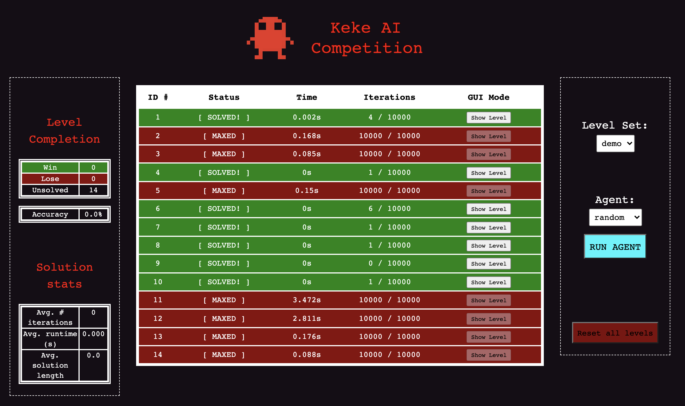
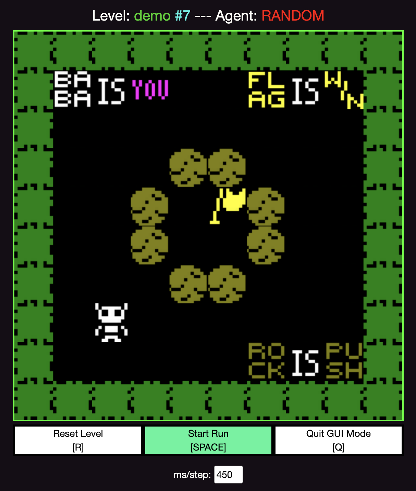
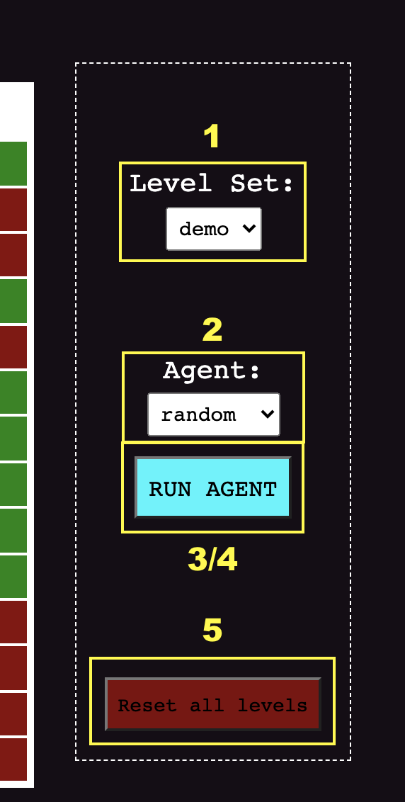

# KekeCompetition - JS Version

---
### Introduction
Framework for the Keke Competition - an AI competition for the puzzle game 'Baba is You'.
This version uses the JS implementation originally found on the [Baba is Y'all](http://equius.gil.engineering.nyu.edu/) website

### Requirements
* NodeJS
* Web-browser (preferably Google Chrome)
* Terminal

### Installation
1. Clone this repository to your local machine
2. Download and install the package manager [NodeJS](https://nodejs.org/en/download/)
3. Open a terminal and navigate to the [KekeJS](.) folder
4. Run the command `npm install` to install the necessary packages found in the [package-lock.json](package-lock.json) file

### Usage
#### Start the server: 
1. Run the command `node index-server.html`. 
2. In a browser, go to the URL `localhost:8080` 
    *Note*: this port number can be changed on _line 15_ in the [index-server.html](index-server.html) file

#### Evaluation Mode
Agent stats for a level set can be viewed on the main page. 

#### GUI Mode
If an agent successfully solved a level, the solution can be viewed by clicking the 'Show level' button on the right most side of the level column.

### Agents
*Evaluator Agents* are saved in the [agents](agents/) folder with the extension `[NAME]_AGENT.js` and contains the following examples:
- [default_AGENT.js](agents/default_AGENT.js) - original agent for the Baba is Y'all website evaluator
- [random_AGENT.js](agents/random_AGENT.js) - returns a sequence of length 50 containing random steps
- [empty_AGENT.js](agents/empty_AGENT.js) - an empty template agent

*Output reports* for agent results are saved to the [reports](reports/) folder based in the form `[NAME]_report.json` with the following information for each level evaluated by the agent:
- *id* - the id number for the level evaluated as specified in the level's level_set file.
- *iterations* - number of calls to the agent's `step` function until a solution was found 
    - (Default Maximum per agent: 10k iterations)
- *time* - real-time taken by the agent until a solution was found
    - (Default Maximum per agent: 10 seconds)
- *solution* - agent's returned solution for the level in abbreviated form
    - (Key: *see simulation description*)

#### Create a new agent: 
1. Copy the [empty_AGENT.py](agents/empty_AGENT.py) a new file with the format `[NAME]_AGENT.py` and save it in the [agents](agents/) folder 
2. (Optional) Create any initializing function needed (i.e. queue setup, tree setup, model setup, etc.) and include it in the `init()` function definition of the `module_exports` object
3. Code the step-wise execution code in the `iter_solve` function. The [exec.js](js/exec.js) module will run the agent's `step()` function every iteration and pass it the initial game state of the level.

#### Test an agent
1. On the right side of the interface page, select a level set to evaluate an agent on by clicking the dropdown.
    - *Note*: Level sets are stored in [json_levels](json_levels/)
2. Select an agent to evaluate on by clicking the dropdown
3. Click the **'Run Agent'** button to start the evaluation. 
    - *Note*: Only unsolved level will be solved 
4. Click the **'Pause Agent'** button at any time to stop the evaluation

#### Delete saved agent reports
5. Click the **'Reset all levels'** button to delete the saved reports for this agent on this level set 

### Level Sets
*Level sets* are ascii maps of Baba is You levels. Most of these levels were saved from the Baba is Y'all level editor.

### License
[MIT](https://choosealicense.com/licenses/mit/)
